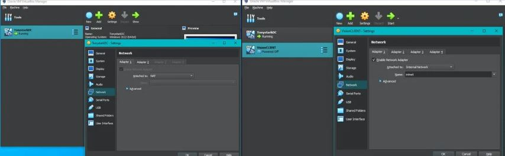
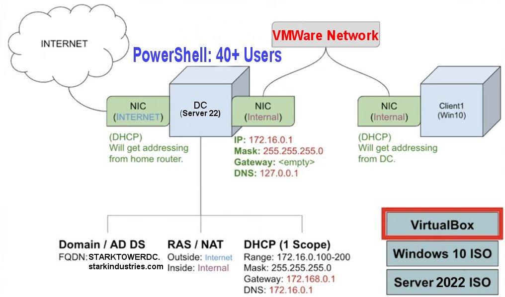
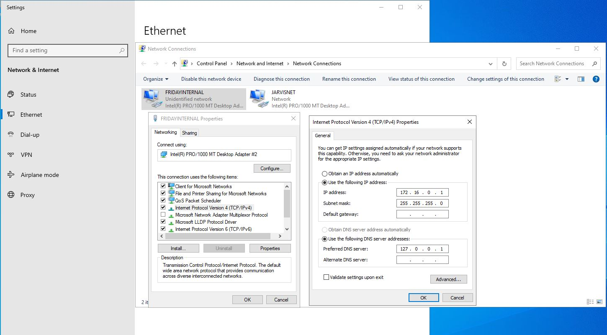
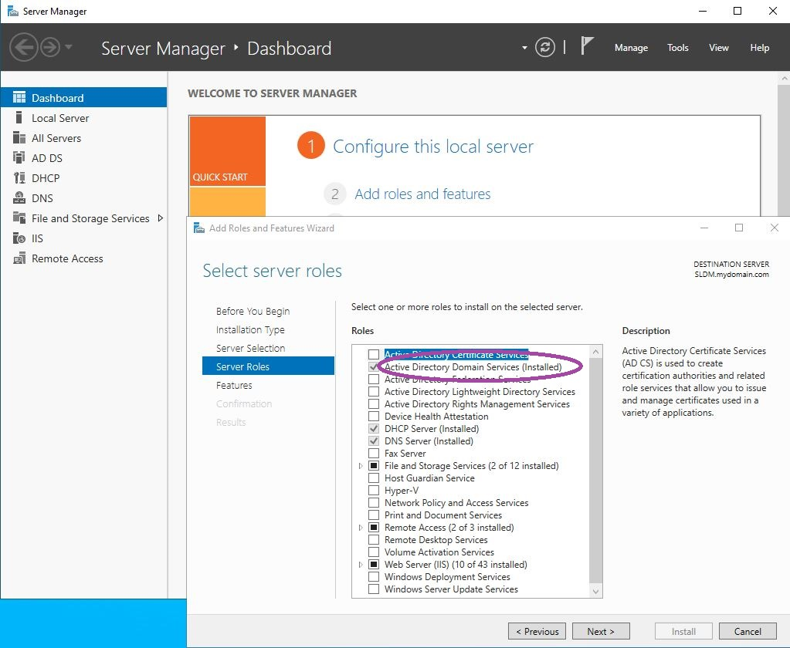
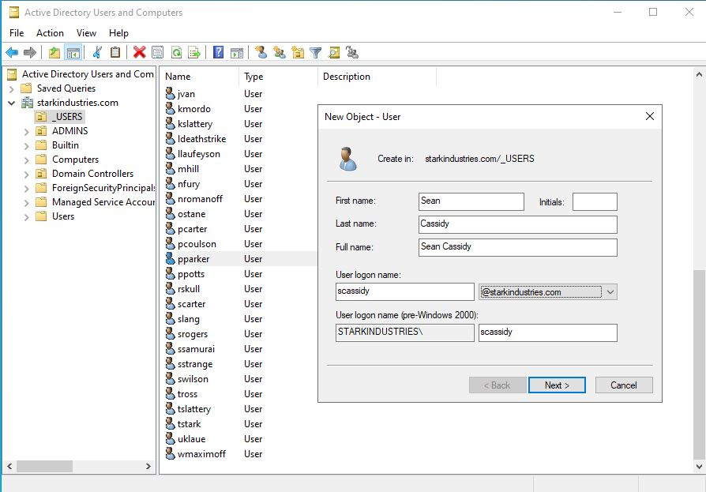
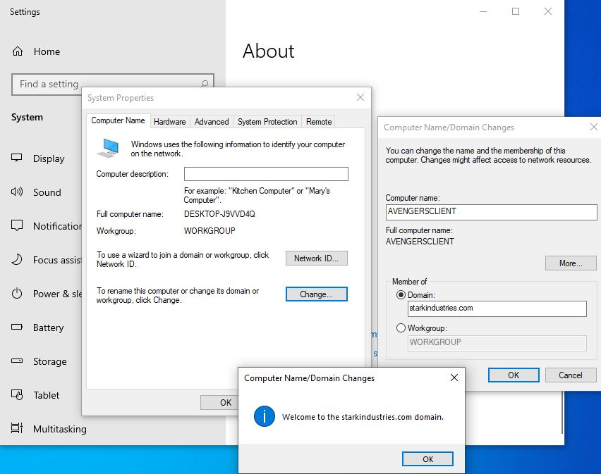
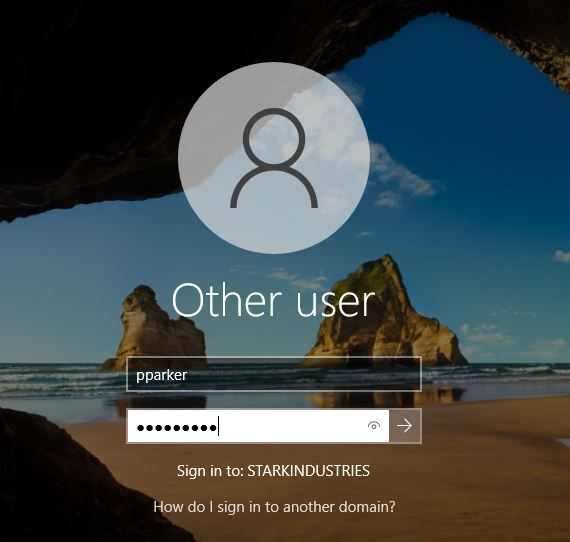
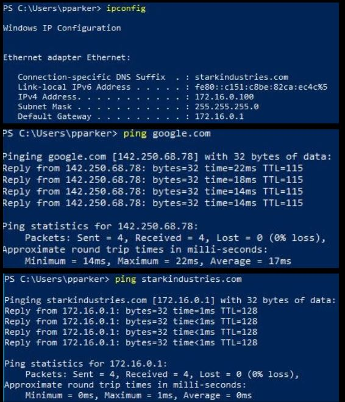

<h1></h1>

<h2>Description</h2>
I created an Active Directory home lab to gain hands-on experience with directory services. By running this home lab, I have enhanced my skills in managing user and computer accounts, configuring and deploying group policies, and ensuring network security within an Active Directory environment. This practical setup enables me to experiment with different configurations and troubleshoot issues in a controlled environment, thereby preparing me for real-world scenarios in enterprise environments.
<br />


<h2>Languages and Utilities Used</h2>

- <b>PowerShell</b> 
- <b>Virtual Box</b>

<h2>🖥️Environments Used💻 </h2>

- <b>Windows 10</b> (21H2)
- <b>Windows Server 2022</b>

<h2>Project walk-through:</h2>

In this project, I set up an Active Directory environment using two virtual machines: one as the Domain Controller and the other as a Client machine. Each Virtual Machine is configured with two network adapters to ensure proper network communication. I used NAT to host the IP address from my router and an internal network so that my Domain controller can communicate with external networks. 

<p align="center">
Set Up Virtual Machines (VMs) <br/>

 <br />
<br />
Diagram <br/>

<br />
<br /> 
Configure Network Settings  <br/>

<br />
<br />
Install Active Directory Domain Services (AD DS) <br/>

<br />
<br />
Create Users <br/>

 <br />
<br />
Join Client Machine to Domain  <br/>

<br />
<br />
Successful Log in <br/>

<br />
<br />
Connection Confirmed!  <br/>

<br />
<br />
</p>

<h2>Goal:</h2>
To build practical skills that can be directly applied in IT roles involving network and systems administration.

<!--
 ```diff
- text in red
+ text in green
! text in orange
# text in gray
@@ text in purple (and bold)@@
```
--!>
